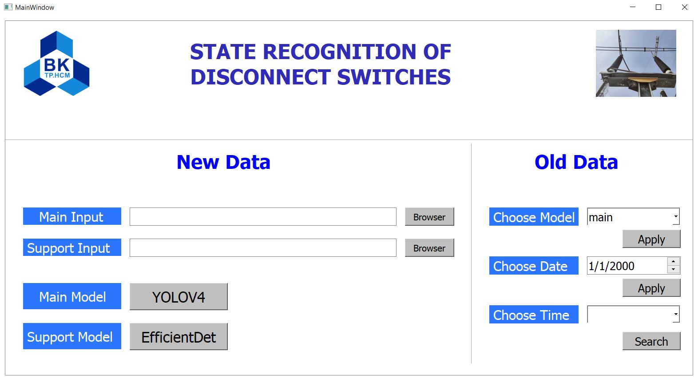
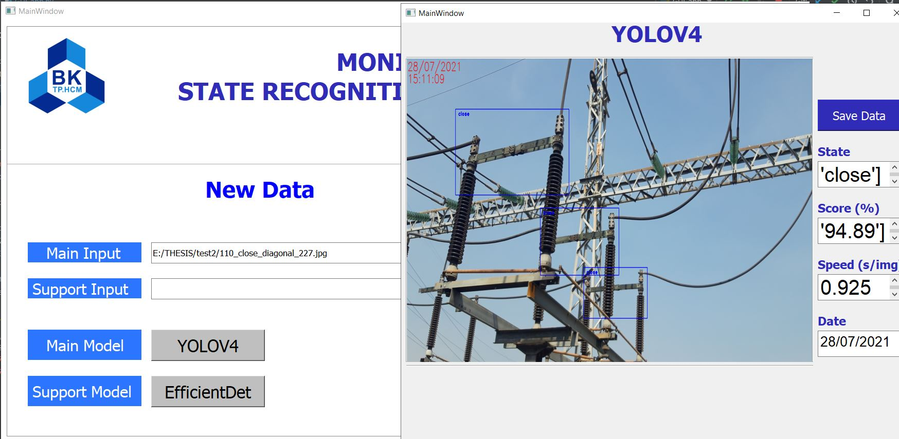

#  State Recognition of Disconnect Switches
### Using Yolov4 Darknet and EfficientDet D0 Tensorflow OD API
- Link to the models [drive](http://drive.com/abc/11111)
# Installation 
### Opencv
### Tensorflow >2.0, Tensorflow OD API 2

# Run GUI_app.py 
This is the main GUI after run this script:

-Browse the main input or support input images and run prediction with Yolov4 or EfficientDet buttons respectively.

# Save Data to Excel
Push Save Data on the "Model windows"
